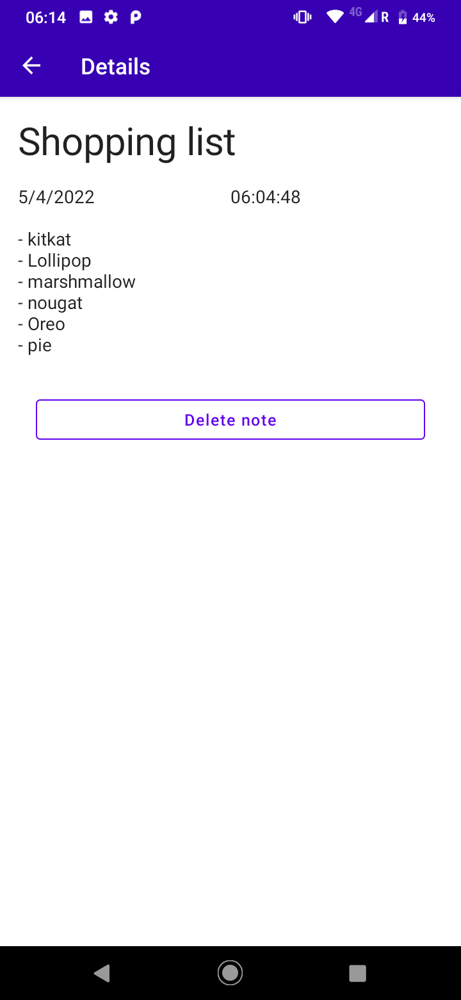
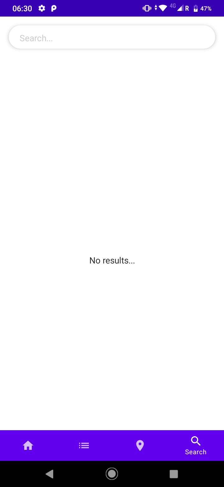

# mcOrganizer - Compose App

## Android
- Kotlin
- Jetpack Compose
- Hilt
- Coroutines
- Flow
- Channels
- Repository pattern
- SOLID
- DataStore Preferences
- Room
- Accompanist Permissions
- MutableStateFlow
- Splash API
- Navigation Compose
- Pager
- Google Maps
- Google Location
- Permissions Accompanist

